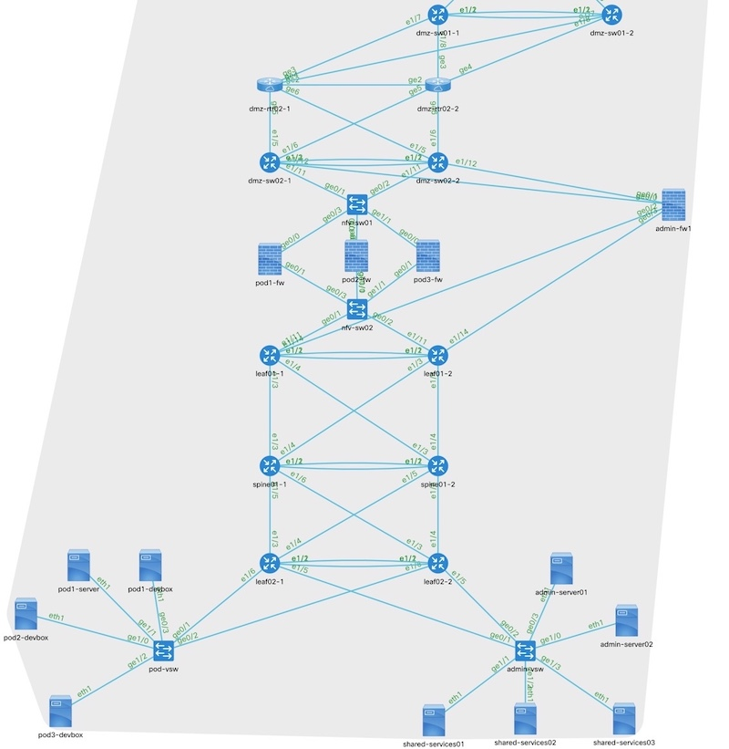

# DevNet Sandbox NSO Resources 
Within this repo you'll find a colleection of [Cisco NSO](https://developer.cisco.com/nso) resources built by the [DevNet Sandbox](https://developer.cisco.com/sandbox) team as part of their internal network automation and NetDevOps efforts.  

For more information on these examples and services, please see the following resources.  

* [Network Service Based Automation Part 1 – The Experience](https://blogs.cisco.com/developer/network-service-based-automation-1): Demonstration of the `vlan-fabric` and `vlan-tenant` services
* [Network Service Based Automation Part 2 – Building Services](https://blogs.cisco.com/developer/network-service-automation-2): Technical walkthrough of building the `vlan-fabric` and `vlan-tenant` services.

## Example/Development Network
The examples within this repository are built using a network topology that resembles the actual DevNet Sandbox network modeled with netsim.  For reference, here is a topology diagram.  



## Software Pre-reqs 
In order to run this code, you'll need to have the following installed and functional.  

### Cisco NSO 
As these examples are for using Cisco NSO for network automation, you'll need it installed.  You can find the software available for free non-production use on DevNet at [https://developer.cisco.com/nso](https://developer.cisco.com/nso).  

> The version of NSO currently used and tested by the Sandbox team is 5.2.0.3 but newer versions should work. 

#### Cisco NSO NEDs 
In addition to Cisco NSO, you'll need to have the following NEDs, or "Network Element Drivers" installed.

> NEDs are used to connect to and manage different infrastructure components.  The list below is what is used within the Sandbox environment, and the services, packages, and automation expect they are available.  If you are interested in trying NEDs out for evaluation, you can work with your Cisco Partner or Account Team to gain access ot them for evaluation purposes.  

```
admin@ncs# show packages package * package-version
                        PACKAGE  
NAME                    VERSION  
---------------------------------
cisco-asa-cli-6.7       6.7.5    
cisco-ios-cli-6.33      6.33.7   
cisco-nx-cli-5.10       5.10.5   
cisco-ucs-cli-3.3       3.3.2    
resource-manager        3.4.0    
vmware-vsphere-gen-3.2  3.2.1    
```

> *Alternatively the examples and code could be modified to NOT require some of the packaged (example VMware or Cisco UCS), however making those changes would need to be done by someone knowledgeable about NSO development.*

## Trying out the examples
If you have all the pre-reqs installed, you can setup a development environment with the included [`Makefile`](Makefile).  

```
make dev
```

This will: 

1. Create a `netsim` version of the topology
1. Setup a local nso within the directory linked to the `netsim` network. 
1. Deploy some basic initial configuration needed for the other examples.

### Testing `vlan-fabric` and `vlan-tenant`
With the development environment setup, you can deploy a sample fabric and tenants with

```
make dev-fabric
```

This will: 
1. Deploy 3 `vlan-fabrics`
1. Deploy 8 `vlan-tenants`

A sample diagram showing these configurations is included: [`sample-topology-vlan-fabrics.jpg`](readme-resources/sample-topology-vlan-fabrics.jpg)

### Cleanup
To "clean-up" the demo, just run `make clean` to stop and delete the NSO and `netsim` environment.  

## NSO Services and Packages 
### vlan-fabric 
A "vlan-fabric" is a collection of L2 network devices that will share common VLAN configurations.  The `vlan-fabric` service for Sandbox describes the devices that make up the fabric, and how they are connected together.  Then NSO will ensure that the devices are configured as required.  Here is an example of a fabric configuration. 

```
vlan-fabric dmz02
 switch-pair dmz-sw02
  layer3 true
  primary   dmz-sw02-1
  secondary dmz-sw02-2
  !
  vpc-peerlink id 1
  vpc-peerlink interface 1/1
  vpc-peerlink interface 1/2
  !
  fabric-trunk 2
   interface 1/11
 !
 switch nfv-sw01
  fabric-trunk 2
   interface 0/1
```

In a fabric a `switch-pair` represents a pair of Cisco NX-OS devices that will be configured in a VPC relationship.  You simply need to specify which device is primary and secondary, and the ports that make up the peerlink.  

A `switch-pair` can be configured with `layer3 true` (the default is `layer3 false`).  This indicates that within this fabric, this pair of devices would be configured with SVIs for networks, including HSRP and OSPF for routing.  

A `switch` would be an independent switch, or either IOS or NX-OS model.  

For both `switch-pairs` and `switches`, the `fabric-trunks` identify interswitch links that connect to other devices in the fabric.  The service will setup LACP port-channels made up of the identified interfaces, and configure them to be dot1q trunks.  

A `vlan-fabric` can also include Cisco UCS and VMware networks.  You'd add them to a fabric like this. 

```
vlan-fabric dmz02 
 fabric-interconnect ucsfi01
  vnic-template-trunks org sandbox vnic-template esxi-vnic

 vmware-dvs vcenter myvcenter datacenter sandbox dvs mydvs
```

In this case, the service will configure VLANs within UCS and then add them to the specified `vnic-templates`.  It will also create new VMware port-groups on the `dvs` specified.  

For a more complete example of `vlan-fabric` configurations, you can look at [sample-vlan-fabrics.cfg](nso-configurations/sample-vlan-fabrics.cfg) or [sample-vlan-fabrics.xml](nso-configurations/sample-vlan-fabrics.xml)

### vlan-tenant 
A `vlan-fabric` is simply a defintion of the network devices that make up a part of the network, but to create vlans and networks on the fabric a `vlan-tenant` is used.  

The `vlan-tenant` describes a set of `networks` (or VLANs) that make up a single layer-3 environment.  Here is an exmaple of a `vlan-tenant` configuration.  

```
vlan-tenant admin
 fabric internal
 static-routes 0.0.0.0/0
  gateway 10.255.250.4
 !
 network admin-main
  vlanid  11
  network 10.255.2.0/23
  connections switch admin-vsw
   interface 0/3
    mode access
 !
 network admin-small
  vlanid  12
  network 10.255.1.0/24
```

Notice how the `vlan-tenant` exists on a `fabric` - this is the linkage that determines which switches and other devices these networks will be created on.  

A VRF will be configured for the  `vlan-tenant` (if at least one network is configured for `layer3-on-fabric true`).  You can add static routes to the VRF as part of the tenant configuration.  

You can add as many `network` objects to the tenant as you desire.  Each `network` will need a `vlanid` and `network` (or prefix) specified.  The service will then create this VLAN on all devices in the fabric.  

If there are any physical network connections into a network needed, you can specify them with `connections`.  

For a more complete example of `vlan-tenant` configurations, you can look at [sample-vlan-tenants.cfg](nso-configurations/sample-vlan-tenants.cfg) or [sample-vlan-tenants.xml](nso-configurations/sample-vlan-tenants.xml)

## netbox-scripts 
In DevNet Sandbox we strive to use a Source of Truth driven infrastructure.  Our Source of Truth is [netbox](https://netbox.readthedocs.io), and it is where our network configuration and validation data comes from.  In the [`netbox-scripts`](netbox-scripts) folder you'll find a sample of scripts that we use as part of our production automation jobs and routines.  As every organizations network will be unique, we provide these scripts not with the idea they can be used as-is, but rather as examples of how such integration might be done.  

Some examples and details... 

### `nso_tenant_config.py` 
One of the most valuable bits of network automation we use is the one that ensures Layer 2 and Layer 3 environments are configured correctly across our infrastructure.  We use the NSO Services `vlan-fabric` and `vlan-tenant` to do the configuration, but the data for the hundreds of tenants is driven by the data we input into Netbox.  The script [`nso_tenant_config.py`](netbox-scripts/nso_tenant_config.py) was developed to read in the data from Netbox and create the NSO configurations to match.  Some details on how this configration is driven... 

* Netbox Tenants relate to `vlan-tenants` in NSO
* Netbox VLAN-Groups relate to `vlan-fabrics` in NSO 
* VLANs that belong to a tenant are used to populate the `networks` under a Tenant 
* Prefixes assigned to VLAN are used to derive the Layer 3 details for a `network` 
* Physical network device interfaces on switches that are **Tagged** or **Untagged** in Netbox drive the `connections` for a `vlan-tenant` `network`
* Link Aggregation Groups (LAGs) in Netbox drive Port-channel configurations for `connections` 

### `get_from_netbox.py` 
This is a collection of helper scripts and code that prepare the Python environment for a script with the names and functions needed to make other scripts easier to write.  